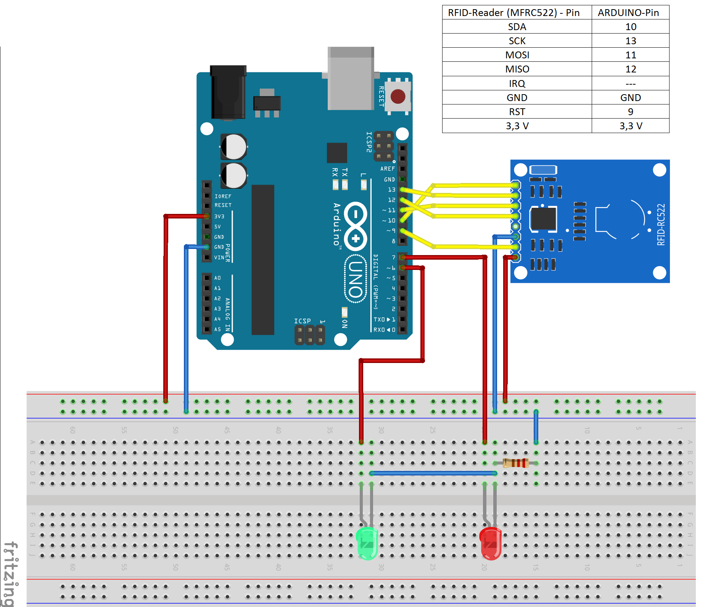
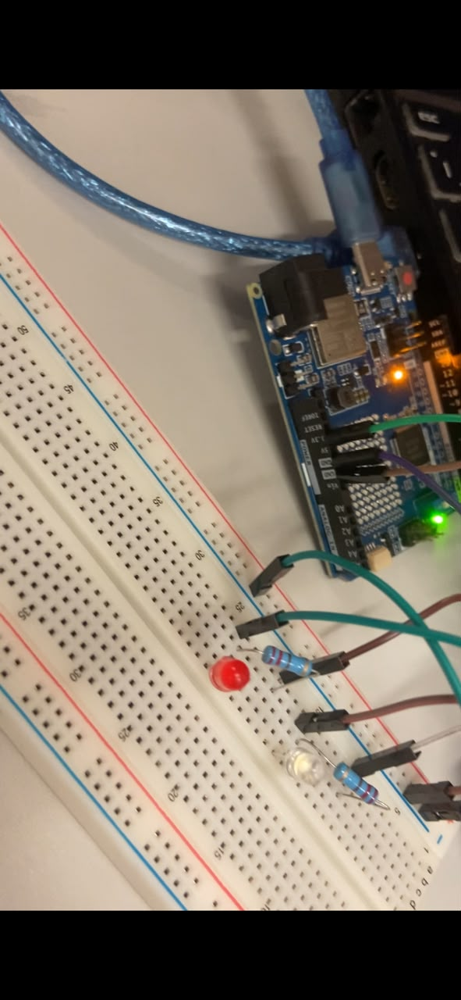

# Control de Acceso con Módulo RFID RC522

## Descripción
Esta práctica implementa un sistema de control de acceso mediante un módulo RFID RC522
y un Arduino UNO R4 WiFi. El sistema lee el UID de cualquier tarjeta RFID acercada al
lector y determina si el acceso es concedido o denegado, indicando el resultado mediante
un LED verde (acceso concedido) y un LED rojo (acceso denegado).

La comunicación entre el Arduino y el módulo RC522 se realiza mediante el protocolo SPI,
usando las líneas SCK, MOSI, MISO y SS. El control de tiempo de los LEDs se implementó
con millis() para no bloquear el programa entre lecturas.

## Objetivos de aprendizaje

* Comprender el funcionamiento del protocolo SPI para la comunicación con el módulo RFID RC522.
* Implementar un sistema de control de acceso basado en la lectura del UID de tarjetas RFID.
* Distinguir entre tarjetas autorizadas y no autorizadas mediante indicadores visuales.
* Utilizar millis() para el control de tiempo sin bloquear la ejecución del programa.
* Verificar el esquema de conexiones en Tinkercad antes del montaje físico.

## Material utilizado

* Arduino UNO R4 WiFi.
* Módulo RFID RC522.
* Tarjeta RFID (credencial pasiva).
* LED verde (acceso concedido — Pin D2).
* LED rojo (acceso denegado — Pin D3).
* 2 resistencias de 220 Ω.
* Protoboard.
* Cables de conexión (jumpers).

## Diagrama del circuito

### Evidencia del circuito físico

## Código
[Ver código](Codigo/)

## Video del funcionamiento

[Ver video](https://youtube.com/shorts/8hMWGaONmiY?feature=share)

## Reporte
El reporte incluye la introducción, metodología, diagrama de conexiones, capturas del
Monitor Serie, análisis de resultados, conclusiones y las preguntas de la práctica respondidas.

[Ver Reporte](Reporte/Reporte_PracticaRFID.pdf)

## Resultados

[Ver Resultados](Resultados/Resultados_PracticaRFID.pdf)

## Conclusiones
El protocolo SPI permite una comunicación rápida y confiable entre el Arduino y el módulo
RC522 usando cuatro líneas de datos más la señal de reset. La identificación por UID
permite distinguir de forma única cada tarjeta RFID, siendo la base de cualquier sistema
de control de acceso.

El uso de millis() en lugar de delay() fue fundamental para mantener el sistema siempre
activo y listo para detectar nuevas tarjetas, incluso mientras el LED permanecía encendido.
